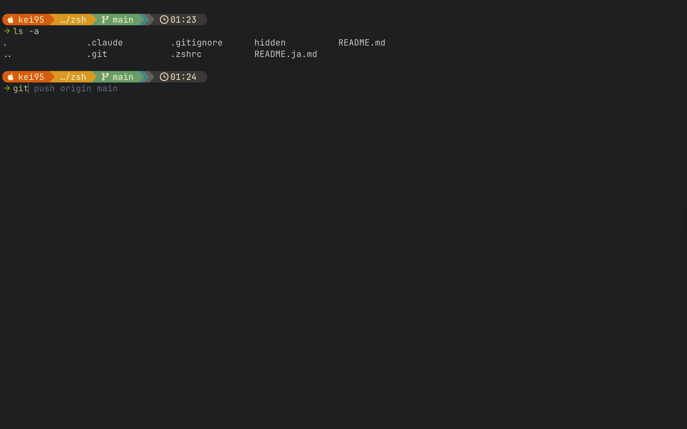

### [日本語はこちら](README.ja.md)

# .zshrc

Personal configuration for zsh. Following the Ghostty team's "Zero Configuration Philosophy", this config contains only minimal customizations.

It includes features like shell prompt, syntax highlighting, autosuggestions, and command history search.

## Used Tools

- [zsh](https://www.zsh.org/) - A powerful shell that operates as both an interactive shell and a scripting language interpreter.
- [Homebrew](https://brew.sh/) - The missing package manager for macOS (or Linux).
- [Starship](https://starship.rs/) - The minimal, blazing-fast, and infinitely customizable prompt for any shell.
- [zsh-autosuggestions](https://github.com/zsh-users/zsh-autosuggestions): Fish-like fast/unobtrusive autosuggestions for zsh.
- [zsh-syntax-highlighting](https://github.com/zsh-users/zsh-syntax-highlighting) - Fish shell-like syntax highlighting for Zsh.
- [Neovim](https://neovim.io/) (Optional) - A hyperextensible Vim-based text editor.

## Features

### Key Bindings

| Key              | Action                                                  |
| ---------------- | ------------------------------------------------------- |
| `↑` (Up Arrow)   | Search history for commands starting with current input |
| `↓` (Down Arrow) | Search history for commands starting with current input |

### Other Settings

- **WORDCHARS**: Set to empty string so word deletion (`Ctrl+W`, `Alt+Backspace`) stops at path separators (`/`), dots, etc.
- **LANG**: Set to `en_US.UTF-8`
- **EDITOR**: Set to `nvim` (Neovim)

### Hidden Directory Auto-loading

All `.zsh` files in `~/.config/zsh/hidden/` are automatically sourced. This is useful for machine-specific configurations or secrets that shouldn't be committed to git.

## Installation

1. **[IMPORTANT]** Set the following code in your `.zshrc` file

```zsh
# ~/.zshrc

# Grab zsh config from this repo
if [ -f "$HOME/.config/zsh/.zshrc" ]; then
  source "$HOME/.config/zsh/.zshrc"
fi
```

2. Clone this repo
   `git clone https://github.com/kei95/zsh ~/.config/zsh`

3. Install prequired modules

```markdown
1.  Install [Homebrew](https://brew.sh/) and make sure it's in your PATH
2.  Install zsh: `brew install zsh`
3.  Install starship: `brew install starship`
4.  Install zsh-autosuggestions: `brew install zsh-autosuggestions`
5.  Install zsh-syntax-highlighting: `brew install zsh-syntax-highlighting`
6.  (Optional) Install [Neovim](https://neovim.io/) and set it up as your default editor
```

4. Restart your terminal or run `source ~/.zshrc` to apply the changes.

## `hidden/` Directory

Use this directory to store any sensitive information or configurations that it specific to your environment. This directory is included in the `.gitignore` file to prevent accidental commits of sensitive data. In order to make files recognizeable by the main `.zshrc`, you simply create files with `.zsh` extension.

example:

```
hidden/
├── script.zsh
└── secret.zsh
```

## Starship Configuration (Prompt Customization)

Starship is system prompt customization tool. It gives you great presets out of the box. I personally use gruvbox-rainbow preset. If you would, you can set it up by running the following command:

`starship preset gruvbox-rainbow -o ~/.config/starship.toml`

If you wanted, you could also customize it further by editing the `~/.config/starship.toml` file. Look here for more details: [Starship Configuration](https://starship.rs/config/)
